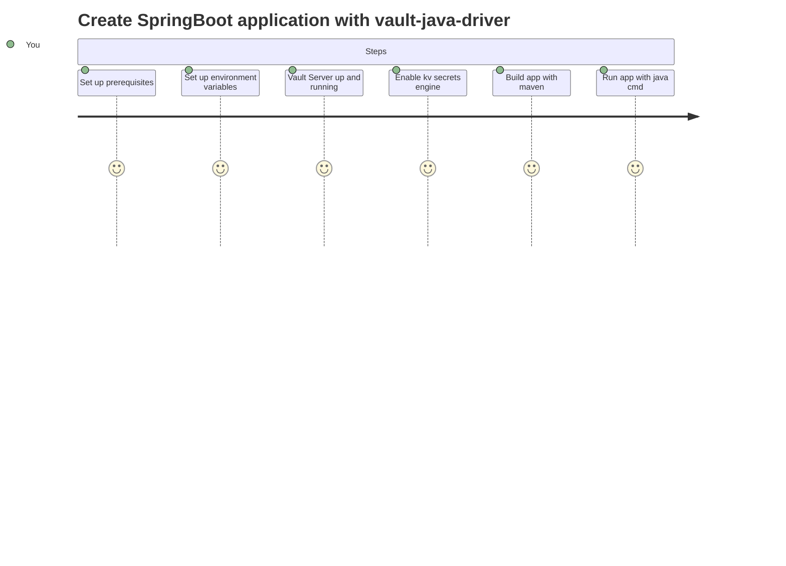

# hello-vault-driver
Runnable example of how to integrate a Java Spring Boot application with
[HashiCorp](http://www.hashicorp.com) [Vault](https://www.vaultproject.io/), using the community-maintained
[Vault Java Driver](https://github.com/BetterCloud/vault-java-driver) library.

## Introduction

This is a simple SpringBoot application example using vault-java-driver of reading and writing your first secret!

## Prerequisites
- Java JDK installed
- Maven installed

and access to one of the following Vault environments
- Vault OSS
- HashiCorp Vault Enterprise
- HCP Vault 

Set the following environment variables:

| Environment variable | Default value      |
|-----|---|
|  VAULT_ADDR   |  http://127.0.0.1:8200 |
|  VAULT_TOKEN   | root  |
|  VAULT_NAMESPACE   | admin  |

## Tested prerequisites
- [Vault OSS](https://vaultproject.io)
- [HCP Vault](https://cloud.hashicorp.com/products/vault)
- [Apache Maven 3.8.6](http://maven.apache.org)
- [OpenJDK 18.0.2](https://jdk.java.net/18/)

## Workflow

### Vault server up and running (not applicable to HCP Vault)

`$ vault server -dev -dev-root-token-id=root`

## Enable kv secrets engine using CLI

`$ vault secrets enable kv`

## Building the app
`$ mvn clean install -DskipTests`

## Running the app
`$ java -jar target/hello-vault-driver-0.0.1-SNAPSHOT.jar`
